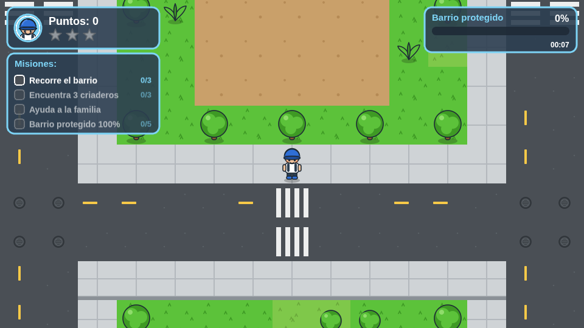
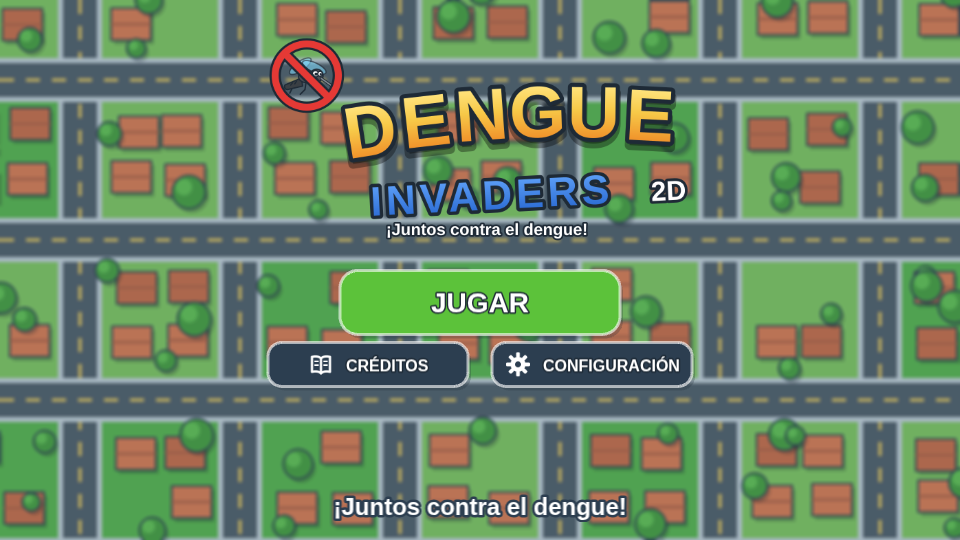
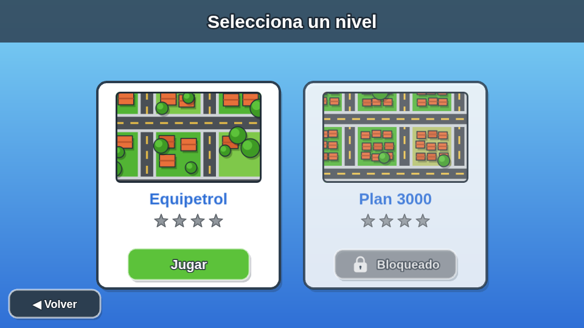
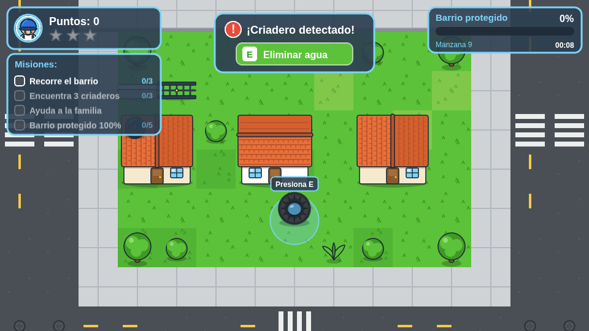
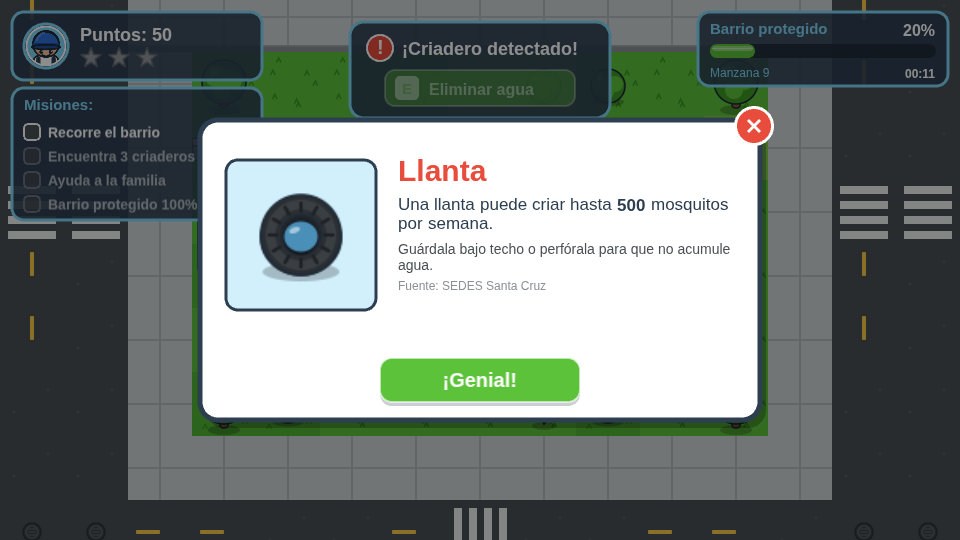
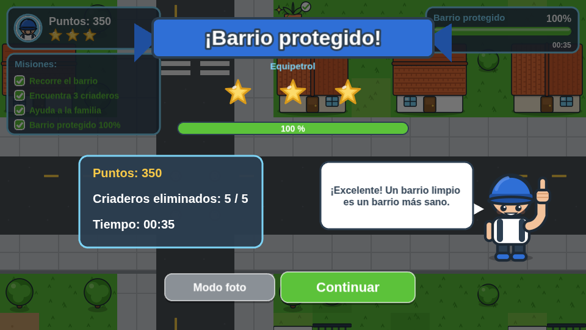
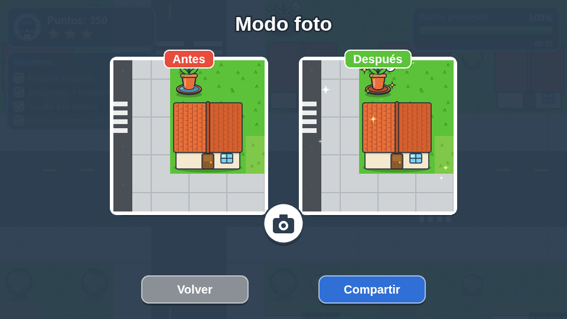
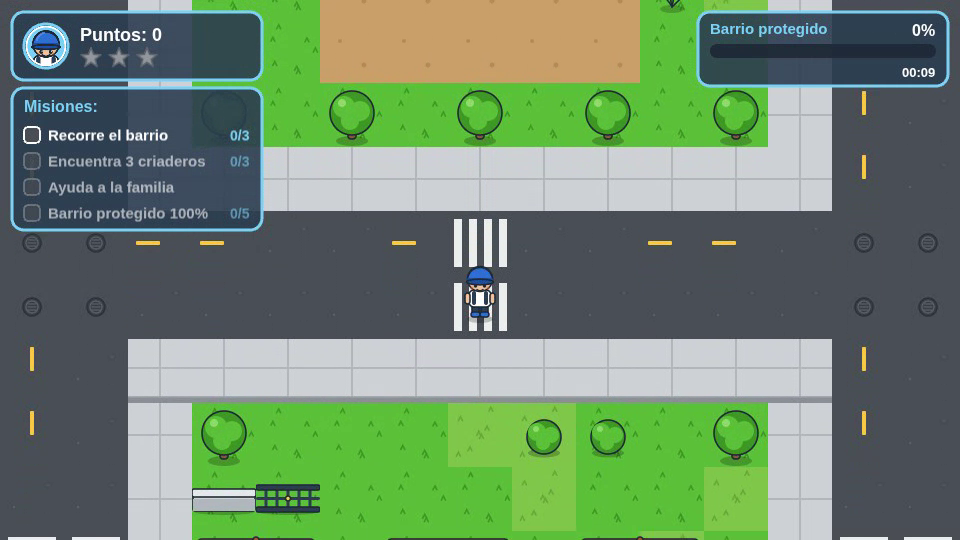

# Dengue Invaders 2D

Prototipo web educativo en 2D (vista superior) para estudiantes de Santa Cruz, Bolivia.
El jugador recorre un barrio ficticio inspirado en Equipetrol, detecta criaderos del
mosquito *Aedes aegypti* (llanta, tanque, balde, botella, florero) y los elimina.
Cada criadero limpio muestra un dato educativo y suma puntos; al limpiar todos, el
barrio queda "protegido" y se puede compartir una foto antes/después.

Corre 100 % en el navegador (escritorio y móvil), sin backend ni base de datos:
el progreso se guarda en `localStorage`. Construido con [Phaser 3.90](https://phaser.io) y [Vite](https://vite.dev).

## Captura



| Menú | Selección | Detección | Popup | Fin de nivel | Modo foto |
|---|---|---|---|---|---|
|  |  |  |  |  |  |

## Video demo

Recorrido completo de ~60 s: menú, selección de nivel, caminata por el barrio, animación de
eliminación de un criadero, popup educativo, fin de nivel con estrellas y modo foto.

- [docs/demo/dengue-invaders-demo.webm](docs/demo/dengue-invaders-demo.webm) (VP8, 960×540)
- [docs/demo/poster.png](docs/demo/poster.png) (fotograma del segundo 10)

[](docs/demo/dengue-invaders-demo.webm)

Se regenera con `npm run build && npm run demo:video` (`tools/record-demo.mjs`, requiere
Playwright con Chromium; si hay `ffmpeg` con libx264 en el PATH también produce un `.mp4`).

## Cómo correrlo

Requiere Node.js 20 o superior.

```bash
npm install          # instala phaser, vite y sharp
npm run gen:assets   # genera sprites, tileset, UI, logo y miniaturas en public/assets/
npm run gen:level    # genera el barrio en src/levels/equipetrol.json (valida el mapa)
npm run gen:sfx      # sintetiza los .wav de efectos y música en public/assets/audio/
npm run dev          # servidor de desarrollo (http://localhost:5173, accesible en la red local)
npm run build        # build de producción en dist/
npm run preview      # sirve dist/ para probar el build
```

Los assets generados están versionados en el repositorio, así que `npm install` y
`npm run dev` bastan para jugar. Los tres scripts `gen:*` solo hacen falta si se
cambia la paleta, el mapa o los sonidos.

## Controles

| Acción | Escritorio | Móvil |
|---|---|---|
| Moverse (8 direcciones) | `WASD` o flechas | Joystick táctil: toca y arrastra en la mitad izquierda de la pantalla |
| Eliminar agua del criadero detectado | `E` | Botón "E · Eliminar agua" del cartel de detección |
| Volver / cerrar | `Esc` (selección de nivel), `Enter` (menú → jugar) | Botones en pantalla |

## Estructura de carpetas

```
build-with-fable/
├── index.html                 # contenedor #game, viewport móvil
├── package.json               # scripts dev/build/preview/gen:*
├── vite.config.js             # base: './' (funciona en subrutas como GitHub Pages)
├── .github/workflows/deploy.yml  # despliegue automático a GitHub Pages
├── docs/
│   ├── PLAN_DESARROLLO.md     # plan del MVP por etapas
│   ├── PROGRESO.md            # bitácora de avance por fase
│   ├── ARQUITECTURA.md        # escenas, eventos, contratos y formato de nivel
│   ├── ASSET_PROMPTS.md       # guía de estilo y prompts para ilustraciones
│   ├── capturas/              # capturas para este README
│   └── referencias/           # plan original
├── tools/
│   ├── gen-assets.mjs         # SVG → PNG de personaje, criaderos, tileset, UI, logo, miniaturas
│   ├── gen-level.mjs          # genera y valida src/levels/equipetrol.json
│   └── gen-sfx.mjs            # sintetiza los WAV (sin dependencias)
├── public/assets/
│   ├── anim/                  # player.png + player.json (atlas 4 direcciones × 4 frames)
│   ├── sprites/               # criaderos (<tipo>_agua|_vacio|_limpio, agua_<tipo>), escenario, partículas
│   ├── tiles/                 # tileset.png + tileset.json (nombres de tile)
│   ├── ui/                    # panel, botones, estrellas, barra, íconos, retratos
│   ├── img/                   # logo, fondo del menú, miniaturas de nivel
│   └── audio/                 # step, detect, gluglu, pop, points, win, click, music (.wav)
└── src/
    ├── main.js                # configuración de Phaser (960×540, Scale.FIT, arcade)
    ├── scenes/                # Boot, Menu, LevelSelect, Game, HUD, Popup, LevelEnd, Photo
    ├── objects/               # Player.js, Criadero.js
    ├── systems/               # EliminationFX, AudioManager, MissionManager, ScoreManager,
    │                          # SaveSystem, LevelLoader, InteractionPrompt, Joystick
    ├── data/                  # palette.js, facts.js (datos SEDES), levels.js (catálogo)
    └── levels/                # equipetrol.json (generado)
```

Detalles de escenas, eventos y formatos en [docs/ARQUITECTURA.md](docs/ARQUITECTURA.md).
Estado del proyecto en [docs/PROGRESO.md](docs/PROGRESO.md).

## Regenerar assets y nivel

- **Gráficos** (`npm run gen:assets`): `tools/gen-assets.mjs` dibuja cada pieza como SVG
  usando `src/data/palette.js` y la exporta a PNG con `sharp`. Si cambias un color de la
  paleta, vuelve a correrlo y todos los sprites quedan coherentes.
- **Nivel** (`npm run gen:level`): `tools/gen-level.mjs` construye el barrio de 40×30 tiles
  con una semilla fija (mapa determinista), coloca casas, muros, árboles, zonas, spawn y
  5 criaderos, y valida el resultado (criaderos en patios, sin solapes, distancia mínima).
  Si la validación falla el script termina con error y explica el motivo.
- **Sonido** (`npm run gen:sfx`): `tools/gen-sfx.mjs` sintetiza 7 efectos y una pista de
  música en loop como WAV 22 050 Hz mono, 16 bits. Es reproducible (RNG con semilla).

## Reemplazar los assets generados por ilustraciones propias

El código nunca depende del contenido de un PNG, solo de su **nombre y tamaño**. Para
usar ilustraciones propias (dibujadas a mano o generadas con IA):

1. Lee la guía de estilo y la lista de prompts en [docs/ASSET_PROMPTS.md](docs/ASSET_PROMPTS.md).
2. Exporta la imagen con **el mismo nombre de archivo y las mismas dimensiones** que el
   generado (por ejemplo `public/assets/sprites/llanta_agua.png`, 64×64; `img/logo.png`;
   `ui/retrato.png`, 128×128; `img/level_equipetrol.png`, 256×160).
3. Cópiala encima del archivo en `public/assets/...`. No hace falta tocar código.
4. Evita volver a correr `npm run gen:assets` sin respaldo: sobrescribe todo lo que genera.

Casos especiales: la hoja del personaje (`anim/player.png`) debe respetar el atlas
`anim/player.json` (frames `down_0..3`, `up_0..3`, `left_0..3`, `right_0..3` de 64×64), y el
tileset (`tiles/tileset.png`) el orden de nombres de `tiles/tileset.json`.

## Despliegue en GitHub Pages

El workflow [.github/workflows/deploy.yml](.github/workflows/deploy.yml) compila y publica
`dist/` en cada push a `main` (o manualmente desde la pestaña *Actions*). Para activarlo
una sola vez en el repositorio:

1. Ve a **Settings → Pages**.
2. En **Build and deployment → Source** elige **GitHub Actions**.
3. Haz push a `main` (o ejecuta *Deploy to GitHub Pages* con *Run workflow*).

Como `vite.config.js` usa `base: './'`, el build funciona en cualquier subruta
(`https://<usuario>.github.io/build-with-fable/`).

## Licencia de datos y créditos

- Los datos educativos de `src/data/facts.js` se redactaron a partir de material de
  divulgación del **SEDES Santa Cruz** (Servicio Departamental de Salud). Son cifras de
  referencia para un prototipo: **verifícalas con la fuente oficial antes de usar el juego
  con público**.
- El barrio es ficticio, inspirado en Equipetrol; no representa calles ni viviendas reales.
- Gráficos y sonidos: generados proceduralmente en este repositorio (`tools/`).
- Motor y herramientas: Phaser 3 (MIT), Vite (MIT), sharp (Apache-2.0).

Créditos completos en [ATTRIBUTION.md](ATTRIBUTION.md).
