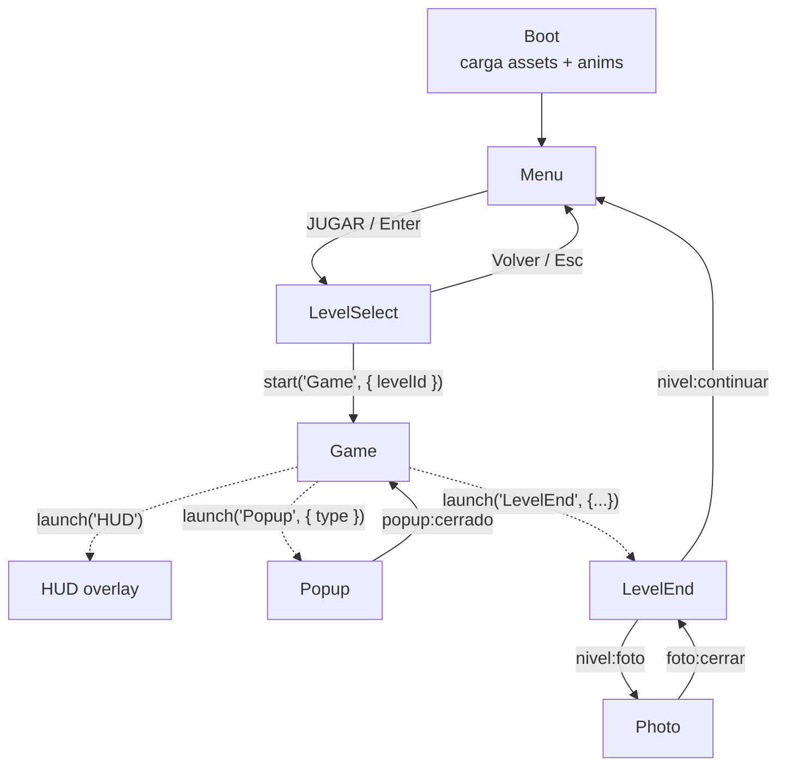

# Arquitectura — Dengue Invaders 2D

Referencia técnica de escenas, eventos, formatos y keys. Complementa a
[PLAN_DESARROLLO.md](PLAN_DESARROLLO.md), [PLAN_V2_JUGABILIDAD.md](PLAN_V2_JUGABILIDAD.md),
[PROGRESO.md](PROGRESO.md) y [GDD.md](GDD.md).

## 1. Escenas y flujo



| Key | Clase | Tipo | Archivo |
|---|---|---|---|
| `Boot` | `BootScene` | Secuencial | `src/scenes/BootScene.js` |
| `Menu` | `MenuScene` | Secuencial | `src/scenes/MenuScene.js` |
| `LevelSelect` | `LevelSelectScene` | Secuencial | `src/scenes/LevelSelectScene.js` |
| `Game` | `GameScene` | Principal | `src/scenes/GameScene.js` |
| `HUD` | `HUDScene` | Overlay paralelo a `Game` | `src/scenes/HUDScene.js` |
| `Popup` | `PopupScene` | Overlay modal (pausa `Game`) | `src/scenes/PopupScene.js` |
| `LevelEnd` | `LevelEndScene` | Overlay modal | `src/scenes/LevelEndScene.js` |
| `Photo` | `PhotoScene` | Overlay modal | `src/scenes/PhotoScene.js` |

Los overlays se lanzan con `this.scene.launch(key, data)` desde `Game` y se cierran con
`this.scene.stop()` desde sí mismos, emitiendo un evento en la escena `Game`
(`this.scene.get('Game').events.emit(...)`). Todas las escenas deben estar registradas en
el arreglo `scene` de `src/main.js`.

Bucle de `GameScene.update()` (v2): `player.move(joystick.update())` → `vehiculo.update()` →
`zoneAt()` para la zona actual → cuenta atrás de la jornada (`JORNADA_SEG = 240` s; a 0 llama
`finDeNivel('tiempo')`) → `outbreakManager.update()` y `epidemicMeter.tick()` (a 100 llama
`finDeNivel('epidemia')`) → `actualizarDeteccion()` (criadero no limpio más cercano dentro de
`Criadero.RADIO_DETECCION`, o si no hay ninguno, un brote activo dentro de `RADIO_DETECCION_BROTE`
— el criadero siempre tiene prioridad) → `actualizarEstacionTip()` → `minimap.update()` /
`compass.update()` → tecla `E` / botón ACCIÓN → `intentarLimpiar()` (dispatcher: `limpiarCriadero()`
si hay un criadero activo, si no `fumigarBrote()`) → tecla `V` / botón VEHÍCULO → `toggleVehiculo()`.
Ver "Sistemas v2" (2.6) para el detalle de brotes, epidemia, estación y camioneta.

## 2. Contratos

### 2.1 Registry del HUD

`HUDScene` lee el `registry` global al crearse y escucha `changedata`. `GameScene` escribe
con `this.registry.set(key, value)`. Keys exportadas como `HUD_KEYS`:

| Key | Tipo | Significado |
|---|---|---|
| `puntos` | `number` | Puntaje actual (al subir, el texto parpadea) |
| `estrellas` | `0..3` | Estrellas proyectadas |
| `limpios` | `number` | Criaderos limpios |
| `total` | `number` | Criaderos del nivel |
| `progreso` | `0..1` | Barra "Barrio protegido" (si no se define, usa `limpios/total`) |
| `zona` | `string` | Nombre de la zona actual (`level.zones[i].name`) |
| `misiones` | `{id, texto, hecho, progreso}[]` | Salida de `MissionManager.lista()` (sin cambios en v2: sigue siendo las 4 misiones de la Fase 5, sin ninguna de brotes/estación/camioneta) |
| `tiempo` | `number` (segundos) | v2: segundos **restantes** de la jornada de 240 s (antes era transcurrido); se muestra como `mm:ss` |
| `epidemia` | `0..100` | v2: valor de `EpidemicMeter`, dibujado como barra roja/amarilla; a partir de 60 el HUD muestra "¡El barrio está en riesgo!" y pulsa |

Método público adicional: `hud.mostrarDato(texto, ms = 4000)` para el dato educativo breve.
El HUD deja libre el centro superior (x 350–610, y 20–120) para el cartel de detección.

### 2.2 Eventos de escena

Todos se emiten en `scene.events` de **`Game`** salvo que se indique.

| Evento | Payload | Lo emite | Lo consume |
|---|---|---|---|
| `sfx` | `name` (`'step'`, `'detect'`, `'gluglu'`, `'pop'`, `'points'`, `'win'`, `'click'`, más v2: `'alert'`, `'spray'`, `'motor'`, `'buzz'`) | EliminationFX, Popup, LevelEnd, Photo, Menu, y v2: `AlertToast` (`'alert'`), `FumigationFX` (`'spray'`), `GameScene.toggleVehiculo` (`'motor'`), `Brote.crecer` (`'buzz'`) | `AudioManager.bind(scene)` → `AudioManager.play(name)` |
| `sfx` en `game.events` | `name` | `sfx()` de `MenuScene.js` (Menu y LevelSelect) | AudioManager debe escuchar también el emisor global |
| `foto:antes` | `criadero` | `playElimination` antes de drenar | GameScene: capturar textura `foto_antes` |
| `foto:despues` | `criadero` | `playElimination` al terminar | GameScene: capturar textura `foto_despues` |
| `popup:cerrado` | `type` del criadero | PopupScene al cerrar | GameScene: reanudar el juego |
| `nivel:continuar` | datos del fin de nivel | LevelEndScene, botón Continuar | GameScene: volver a `Menu` / `LevelSelect` |
| `nivel:foto` | datos del fin de nivel | LevelEndScene, botón Foto | GameScene: `launch('Photo', { antes, despues })` |
| `foto:cerrar` | — | PhotoScene al cerrar | GameScene: reabrir `LevelEnd` o seguir el flujo |
| `cleaned` (en el objeto) | `criadero` | `Criadero` al terminar de limpiarse | GameScene, MissionManager |

Datos de lanzamiento de overlays:

```js
this.scene.launch('Popup',    { type: 'llanta' });
this.scene.launch('LevelEnd', { puntos, limpios, total, tiempo, estrellas, nivelId, nivelNombre, resultado });
this.scene.launch('Photo',    { antes: 'foto_antes', despues: 'foto_despues' });
```

`resultado` (v2, nuevo): `'completo' | 'tiempo' | 'epidemia'` — cómo terminó la jornada (ver 2.6).
`LevelEndScene` usa el valor para elegir el color/título de la cinta y el mensaje del bocadillo;
por defecto `'completo'` si se omite, para no romper llamadas antiguas.

### 2.3 Sistemas sin Phaser

- `MissionManager({ total, misionFamilia })`: `onZona(nombre)`, `onCriaderoLimpio(criadero)`,
  `onChange(cb)`, `lista()` → arreglo para el registry `misiones`. Objetivos: 3 zonas, 3 criaderos.
- `ScoreManager`: `addCriadero(now)` → `{puntos, bonus, combo, total}`; `progreso(limpios, total)`;
  `calcularEstrellas(segundos, completo)`. Constantes: +50, combo +25 dentro de 20 s,
  3 estrellas ≤ 150 s, 2 estrellas ≤ 240 s.
- `SaveSystem` (`saveSystem` instancia compartida): `getNivel(id)` →
  `{estrellas, mejorTiempo, mejorPuntos}`, `guardarNivel(id, {estrellas, tiempo, puntos})`, `reset()`.
  Clave `dengue.progreso`. El sonido usa la clave `dengue.sonido` (`'1'`/`'0'`).
- `EpidemicMeter` (v2): `tick(deltaMs, {brotesActivos, criaderosSucios})`, `registrarFumigado(nivel)`,
  `registrarLimpieza()`, `onChange(cb)`. Ver 2.6 para las tasas de subida/bajada.

### 2.4 UI táctil

- `src/data/ui.js`: `MIN_TOUCH = 64` px de escena (≈ 44 CSS px en un teléfono en horizontal con
  `Scale.FIT`) y `touchSize(w, h)`. Todo botón (`makeButton` de Menu/LevelSelect, Popup, LevelEnd,
  Photo y el "Eliminar agua" de `InteractionPrompt`) usa `setSize(...touchSize(w, h))` antes de
  `setInteractive()`: el área táctil puede ser mayor que el dibujo.
- Objetos fijos a la cámara que reciben input deben tener `scrollFactor 0` **también en el hijo
  interactivo** (`container.setScrollFactor(0, 0, true)`): el hit test de Phaser usa el scrollFactor
  del propio objeto, no el del contenedor padre.
- `Joystick`: solo responde a toques en la mitad izquierda **y por debajo del 40 % de la altura**
  (deja libre el panel de misiones del HUD), e ignora toques que caen sobre un objeto interactivo.
- Aviso "Gira tu dispositivo": overlay DOM `#rotate` en `index.html`, controlado desde `src/main.js`
  solo en dispositivos táctiles cuando la ventana es más alta que ancha (botón "Jugar así de todos modos").

### 2.5 Controles táctiles

Estilo Brawl Stars, solo en **modo táctil**: `esModoTactil(game)` (`src/data/ui.js`) usa
`game.device.input.touch` y se puede forzar con `localStorage 'dengue.touch'` = `'1'` / `'0'`
(pruebas, laptops táctiles). En escritorio no se dibuja ninguno: WASD/flechas, `E`, `Shift` (sprint)
y `Esc` (menú de pausa).

| Control | Archivo | Posición (escena 960×540) | Comportamiento |
|---|---|---|---|
| Joystick fijo | `Joystick.js` (`modo: 'fijo'`) | base en (110, alto − 110), siempre visible | Se activa con un toque a ≤ 90 px de la base o en la zona x < 45 %, y > 45 %; la base no se mueve, el knob se desplaza desde el punto de toque (clamp al radio) y vuelve con tween al soltar. `modo: 'flotante'` conserva el joystick anterior (escritorio). |
| ACCIÓN | `TouchControls.js` | (ancho − 100, alto − 100), r 46 | Misma función que `E` (`GameScene.intentarLimpiar`). Estados `apagado` (gris, alpha 0.4) / `activo` (amarillo + anillo pulsante) / `ocupado` (alpha 0.6) según `{ activo, limpiando }` que GameScene pasa en `touch.update()`. El cartel de `InteractionPrompt` se crea con `{ sinBoton: true }`: muestra "Toca el botón de acción" en lugar del botón. |
| LUPA | `TouchControls.js` | (ancho − 190, alto − 130), r 30 | Con criadero activo → `HUD.mostrarDato(FACTS[type].dato)`; sin activo → flecha alrededor del jugador hacia `GameScene.criaderoMasCercano()` y "Criadero a N m" (N = distancia/64) durante 2 s. Recarga 3 s (gris). |
| CORRER | `TouchControls.js` | (ancho − 100, alto − 200), r 30 | Sprint mientras se mantiene presionado: `Player.setSprint(bool)`, velocidad ×1.6, `player.energia` 0..1 se agota en 3 s y recarga en 4 s (anillo de energía alrededor del botón). `Shift` hace lo mismo en escritorio. |
| PAUSA | `TouchControls.js` + `PauseMenu` | (ancho − 30, 30), r 22 | Abre `PauseMenu` ("Continuar", "Sonido ON/OFF" vía `AudioManager.setEnabled`, "Salir al menú"). En modo táctil el HUD corre el panel "Barrio protegido" 60 px a la izquierda (`OFFSET_PAUSA_TACTIL`). |

`PauseMenu` existe en ambos modos (Esc lo abre y lo cierra): pausa suave dentro de `GameScene`
(`physics.pause()`, HUD oculto, reloj congelado con `tiempoInicio += delta`, `update()` retorna
temprano mientras `pausa.abierta`). Todos los botones tienen hit area ≥ `MIN_TOUCH`,
`setScrollFactor(0, 0, true)`, animación de "press" (scale 0.92) y emiten `sfx 'click'`. La
limpieza en curso deshabilita los botones y el joystick ignora toques sobre cualquier botón
(`over`). `TouchControls.overlays()` devuelve los objetos que `capturar()` oculta en las fotos.

### 2.6 Sistemas v2 (jornada del Agente SEDES)

El bucle base (criaderos, misiones, puntaje, popup educativo) no cambió; v2 le suma una jornada
con presión de tiempo, brotes de mosquitos, un medidor de epidemia y una estación con camioneta.
Constantes clave, todas en `GameScene.js` salvo que se indique: `JORNADA_SEG = 240` (duración de
la jornada, en segundos), `RADIO_DETECCION_BROTE = 90` px, `UMBRAL_RIESGO = 60` (también duplicada
en `HUDScene.js` para el pulso visual), `PUNTOS_BROTE = { pequeno: 75, medio: 90, grande: 100 }`.

- **`Brote`** (`src/objects/Brote.js`): sprite con `nivel` (`'pequeno'|'medio'|'grande'`) y `state`
  (`'activo'|'fumigando'|'fumigado'`). Crece solo con `time.delayedCall` (20 s a `medio`, 40 s más
  a `grande`); textura `mosquito_<nivel>` con fallback (círculo rojo + "!"). `fumigar({rapido})` →
  `Promise<Brote>`, reentrada bloqueada, delega toda la animación en `FumigationFX.playFumigation`.
  Emite `'crecio'` y `'fumigado'` en sí mismo.
- **`OutbreakManager`** (`src/systems/OutbreakManager.js`): `new OutbreakManager(scene, {criaderos,
  bounds})`; `.update(time, delta)` cada frame decide cuándo aparece el próximo brote (25–40 s al
  azar); `elegirPosicion()` — 70 % cerca (80–160 px) de un criadero aún sucio, 30 % al azar dentro
  de `bounds`. `.activos` es la lista viva; `.onChange(cb)` se dispara con `cb(this.activos)` al
  aparecer, crecer o fumigarse un brote.
- **`EpidemicMeter`** (`src/systems/EpidemicMeter.js`, sin Phaser): `.valor` 0..100. `tick(deltaMs,
  {brotesActivos, criaderosSucios})` sube `0.4|0.8|1.5` por segundo según el nivel de cada brote
  activo (pequeño/medio/grande) más `0.05` por segundo por cada criadero sucio.
  `registrarFumigado(nivel)` baja `8|12|18`; `registrarLimpieza()` baja `3` de golpe.
  `onChange(cb)` → `cb(valor, this)`.
- **`FumigationFX`** (`src/systems/FumigationFX.js`): `playFumigation(scene, brote, {rapido})` →
  `Promise<void>`. Nube de partículas `spray` (o círculo celeste pulsante de fallback) mientras el
  propio brote se desvanece (`alpha 1→0`) durante `FUMIGATION_DURATIONS.normal = 2500` ms a pie o
  `.rapido = 1500` ms en la camioneta (`enVehiculo`); al terminar marca `brote.state = 'fumigado'`
  y emite `'fumigado'` en el brote — nunca rechaza, incluso si la animación falla a mitad de camino.
  Emite `sfx 'spray'` al empezar.
- **`Minimap`** (`src/systems/Minimap.js`): `new Minimap(scene, {getEntities})` donde `getEntities()`
  devuelve `{player, estacion, criaderos, brotes, vehiculo}`; redibuja con Graphics cada
  `.update()` proyectando linealmente `physics.world.bounds` a un cuadro fijo arriba a la derecha
  (96 px en vertical, 140 px en horizontal, debajo del panel "Barrio protegido" del HUD).
- **`Compass`** (`src/systems/Compass.js`): `.update(target)` — flecha que orbita al jugador
  (radio 56 px) apuntando a `target` (`{x,y}`, normalmente el brote activo más cercano); oculta si
  `target` es `null`.
- **`AlertToast`** (`src/systems/AlertToast.js`): `.mostrar(texto, ms = 3000)` banner ancho arriba
  de la pantalla con tween de entrada/salida y `sfx 'alert'`; cola de un solo mensaje (una segunda
  llamada mientras hay uno visible reemplaza el texto y reinicia el timer, no encola).
- **`Estacion`** (`src/objects/Estacion.js`): edificio fijo, sin collider; `cerca(player, radio =
  90)`.
- **`Vehiculo`** (`src/objects/Vehiculo.js`): `subir(player)` / `bajar(x, y)`; mientras está
  montado sigue al jugador cada frame en `.update()` (sin cuerpo físico propio, decorativo);
  `cerca(player, radio = 90)`; `setDireccion(dir)` cambia la textura `vehiculo_<dir>`.
- **Estación/camioneta en `GameScene`**: `toggleVehiculo()` (tecla `V` o botón VEHÍCULO) exige
  estar cerca de la estación o de la camioneta para subir; al subir aplica
  `player.setVehiculoFactor(2)` (velocidad ×2, ver `Player.js`) y pasa `rapido: true` a
  `Brote.fumigar()`. Al volver a la estación tras haber salido, se muestra una vez el tip de
  `TIPS.estacion` (`src/data/tips.js`) — no es un popup modal como el de los criaderos, solo un
  `hud.mostrarDato()`.
- **Fin de jornada**: `GameScene.finDeNivel(resultado)` acepta `'completo'` (todos los criaderos
  limpios), `'tiempo'` (se acabaron los 240 s) o `'epidemia'` (el medidor llegó a 100). Estrellas:
  0 si `resultado === 'epidemia'`; si no, 1 por terminar, 2 si el medidor nunca llegó a
  `UMBRAL_RIESGO`, 3 si además `limpios >= total`. `LevelEndScene` cambia el color/título de la
  cinta y el mensaje del bocadillo según `resultado` (ver 2.2).
- **Contenido educativo v2**: `src/data/tips.js` (mensajes cortos por categoría: `fumigar`,
  `estacion`, `brote`, mostrados con `hud.mostrarDato()`) y `src/data/quiz.js` (8 preguntas de
  opción múltiple con explicación, usadas por `LevelEndScene` — una al azar, bonus visual +100 que
  no se guarda en `SaveSystem` ni en el registry).
- **Brecha conocida con el plan**: `MissionManager` (Fase 5) no se modificó para v2 — sigue
  ofreciendo las mismas 4 misiones de siempre (recorrer 3 zonas, encontrar 3 criaderos, ayudar a
  la familia, barrio 100 %), sin ninguna misión de brotes, estación o camioneta pese a que
  `PLAN_V2_JUGABILIDAD.md` la menciona para esta ola. Ver `docs/PROGRESO.md` (v2 · Ola 2).

## 3. Formato de nivel (`src/levels/equipetrol.json`)

Generado por `tools/gen-level.mjs`, consumido por `LevelLoader.buildLevel(scene, level)`.
Coordenadas en **píxeles** (tile de 64 px). Se carga en el cache como `level_equipetrol`.

```jsonc
{
  "name": "Equipetrol",
  "width": 40, "height": 30, "tile": 64,
  "ground": [["pasto", "vereda", "calle", ...], ...],   // height filas × width nombres de tile
  "objects": [{ "type": "casa_a", "x": 64, "y": 128 }, ...], // esquina superior izquierda del sprite
  "spawn": { "x": 864, "y": 864 },
  "zones": [{ "name": "Manzana 1", "x": 0, "y": 0, "w": 320, "h": 192 }, ...],
  "criaderos": [{ "type": "llanta", "x": 864, "y": 1376 }, ...],   // centro del sprite, 5 tipos distintos
  "mision_familia": { "type": "tanque", "x": 224, "y": 1376 },     // debe coincidir con un criadero
  "estacion": { "x": 992, "y": 736 }                               // v2: estación SEDES + camioneta
}
```

`estacion` (v2, nuevo): centro del edificio. `tools/gen-level.mjs` lo coloca en un tile libre de
pasto o vereda a 3–14 tiles del spawn (relajando la distancia si no hay candidato), sin solapar
objetos ni patios reservados para criaderos. Si el JSON del nivel no trae este campo, `GameScene`
usa `level.spawn` como posición de respaldo.

- Nombres de tile válidos (índice = posición en `tiles/tileset.json`): `pasto`, `pasto_oscuro`,
  `pasto_seco`, `calle`, `calle_linea`, `calle_linea_v`, `cruce`, `vereda`, `tierra`, `cruce_v`,
  `esquina`, `vereda_borde`.
- Tipos de objeto (`OBJECT_DEFS` en `LevelLoader.js`): `casa_a`, `casa_b` (128×128, sólidas),
  `arbol`, `arbusto`, `muro_h`, `muro_v`, `porton` (sólidos), `planta`, `tanque_techo` (decorativos;
  `tanque_techo` se dibuja por encima de todo).
- Tipos de criadero: `llanta`, `tanque`, `balde`, `botella`, `florero`.
- El generador valida: casas sobre pasto, spawn sobre vereda, exactamente 5 criaderos de tipos
  distintos en manzanas distintas, dentro de un patio, sin solapar sólidos, a ≥ 2 tiles del
  spawn y ≥ 4 tiles entre sí; `mision_familia` en el patio de una casa con portón.

## 4. Keys de texturas y audio

Todo se carga en `BootScene` desde `import.meta.env.BASE_URL + 'assets/'`.

| Key | Archivo | Notas |
|---|---|---|
| `player` (atlas) | `anim/player.png` + `player.json` | Frames `down_0..3`, `up_0..3`, `left_0..3`, `right_0..3`; anims `walk_<dir>`, `idle_<dir>` |
| `tiles` (spritesheet) + `tilesMeta` (json) | `tiles/tileset.png` + `tileset.json` | 64×64, 4 columnas |
| `casa_a`, `casa_b`, `arbol`, `arbusto`, `planta`, `muro_h`, `muro_v`, `porton`, `tanque_techo` | `sprites/<key>.png` | Escenario |
| `<tipo>_agua`, `<tipo>_vacio`, `<tipo>_limpio`, `agua_<tipo>` | `sprites/<key>.png` | 5 tipos × 4 = 20 imágenes de 64×64 |
| `drop`, `spark`, `noise` | `sprites/<key>.png` | Partículas y máscara de EliminationFX |
| `vehiculo_down`, `vehiculo_up`, `vehiculo_left`, `vehiculo_right` | `sprites/<key>.png` | v2: camioneta de fumigación, 4 direcciones (80×56) |
| `estacion` | `sprites/estacion.png` | v2: edificio SEDES con garaje (160×128) |
| `mosquito_pequeno`, `mosquito_medio`, `mosquito_grande` | `sprites/<key>.png` | v2: brotes de mosquitos, 3 niveles (40/56/72 px) |
| `spray` | `sprites/spray.png` | v2: partícula de la nube de fumigación (32×32) |
| `key_e`, `panel`, `btn_green` | `ui/<key>.png` | UI de fase 3 |
| `alert` | `ui/alert.png` | Ícono del cartel de detección (fase 3) y de `AlertToast` (v2) |
| `retrato`, `retrato_pulgar`, `star_on`, `star_off`, `bar_bg`, `bar_fill`, `btn_gray`, `btn_red_x` | `ui/<key>.png` | UI de fases 5–6 (opcionales: las escenas tienen fallback dibujado) |
| `icon_back`, `icon_book`, `icon_camera`, `icon_gear`, `icon_lock`, `icon_share`, `icon_sound_on`, `icon_sound_off` | `ui/<key>.png` | Íconos |
| `logo`, `menu_bg`, `level_equipetrol`, `level_plan3000` | `img/<key>.png` | Menú y miniaturas (256×160) |
| `foto_antes`, `foto_despues` | (dinámicas) | Creadas en tiempo de ejecución con `snapshotArea` |
| `level_equipetrol` (json) | `src/levels/equipetrol.json` | Importado por URL de módulo (lo empaqueta Vite) |
| `sfx_step`, `sfx_detect`, `sfx_gluglu`, `sfx_pop`, `sfx_points`, `sfx_win`, `sfx_click`, `sfx_alert`, `sfx_spray`, `sfx_motor`, `sfx_buzz`, `music` (audio) | `audio/<nombre>.wav` | `AudioManager.play('gluglu')` usa el nombre sin prefijo; los últimos 4 son v2 (aviso de brote, fumigación, arranque de la camioneta, zumbido de mosquitos) |

## 5. Cómo añadir un nuevo barrio

1. **Generar el nivel.** Copia `tools/gen-level.mjs` (o parametrízalo por nombre) y cambia
   `OUT` a `src/levels/<barrio>.json`, `name`, la semilla del RNG y, si quieres, `H_ROADS` /
   `V_ROADS` y el tamaño `W × H`. Mantén las validaciones: el juego asume 5 criaderos de tipos
   distintos y una `mision_familia` que apunte a uno de ellos. Corre `node tools/gen-<barrio>.mjs`
   (o añade un script `gen:level:<barrio>` en `package.json`).
2. **Cargarlo.** En `BootScene.preload()` añade
   `this.load.json('level_<barrio>', new URL('../levels/<barrio>.json', import.meta.url).href)`.
3. **Catálogo.** En `src/data/levels.js` añade una entrada a `LEVELS`:
   `{ id: '<barrio>', nombre: 'Nombre visible', thumb: 'level_<barrio>', bloqueado: false, data: 'level_<barrio>' }`.
   `id` es la clave de guardado en `SaveSystem` y el `levelId` que recibe `GameScene`; `data` es
   la key del JSON en el cache (`this.cache.json.get(data)`).
4. **Miniatura (opcional).** Genera `public/assets/img/level_<barrio>.png` (256×160) en
   `tools/gen-assets.mjs` (función `buildMenu`) o dibújala a mano; cárgala en `BootScene` con la
   key `level_<barrio>`. Si la textura no existe, `LevelSelectScene` dibuja una por defecto.
5. **Desbloqueo.** Para el flujo "Plan 3000 se desbloquea al terminar Equipetrol", cambia
   `bloqueado` por una comprobación con `saveSystem.getNivel('equipetrol')?.estrellas > 0`
   en `LevelSelectScene`.
