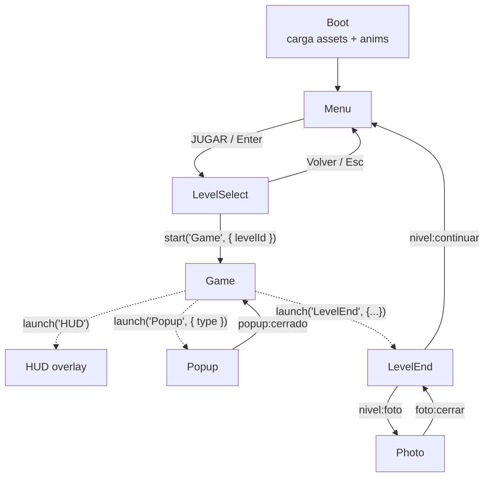

# Arquitectura — Dengue Invaders 2D

Referencia técnica de escenas, eventos, formatos y keys. Complementa a
[PLAN_DESARROLLO.md](PLAN_DESARROLLO.md) y [PROGRESO.md](PROGRESO.md).

## 1. Escenas y flujo



| Key | Clase | Tipo | Archivo |
|---|---|---|---|
| `Boot` | `BootScene` | Secuencial | `src/scenes/BootScene.js` |
| `Menu` | `MenuScene` | Secuencial | `src/scenes/MenuScene.js` |
| `LevelSelect` | `LevelSelectScene` | Secuencial | `src/scenes/LevelSelectScene.js` |
| `Game` | `GameScene` | Principal | `src/scenes/GameScene.js` |
| `HUD` | `HUDScene` | Overlay paralelo a `Game` | `src/scenes/HUDScene.js` |
| `Popup` | `PopupScene` | Overlay modal (pausa `Game`) | `src/scenes/PopupScene.js` |
| `LevelEnd` | `LevelEndScene` | Overlay modal | `src/scenes/LevelEndScene.js` |
| `Photo` | `PhotoScene` | Overlay modal | `src/scenes/PhotoScene.js` |

Los overlays se lanzan con `this.scene.launch(key, data)` desde `Game` y se cierran con
`this.scene.stop()` desde sí mismos, emitiendo un evento en la escena `Game`
(`this.scene.get('Game').events.emit(...)`). Todas las escenas deben estar registradas en
el arreglo `scene` de `src/main.js`.

Bucle de `GameScene.update()`: `player.move(joystick.update())` → `zoneAt()` para la zona
actual → `actualizarDeteccion()` (criadero no limpio más cercano dentro de
`Criadero.RADIO_DETECCION`) → tecla `E` → `intentarLimpiar()` (bloquea al jugador, espera
`criadero.clean()`, suma puntos, muestra dato, comprueba fin de nivel).

## 2. Contratos

### 2.1 Registry del HUD

`HUDScene` lee el `registry` global al crearse y escucha `changedata`. `GameScene` escribe
con `this.registry.set(key, value)`. Keys exportadas como `HUD_KEYS`:

| Key | Tipo | Significado |
|---|---|---|
| `puntos` | `number` | Puntaje actual (al subir, el texto parpadea) |
| `estrellas` | `0..3` | Estrellas proyectadas |
| `limpios` | `number` | Criaderos limpios |
| `total` | `number` | Criaderos del nivel |
| `progreso` | `0..1` | Barra "Barrio protegido" (si no se define, usa `limpios/total`) |
| `zona` | `string` | Nombre de la zona actual (`level.zones[i].name`) |
| `misiones` | `{id, texto, hecho, progreso}[]` | Salida de `MissionManager.lista()` |
| `tiempo` | `number` (segundos) | Tiempo transcurrido, se muestra como `mm:ss` |

Método público adicional: `hud.mostrarDato(texto, ms = 4000)` para el dato educativo breve.
El HUD deja libre el centro superior (x 350–610, y 20–120) para el cartel de detección.

### 2.2 Eventos de escena

Todos se emiten en `scene.events` de **`Game`** salvo que se indique.

| Evento | Payload | Lo emite | Lo consume |
|---|---|---|---|
| `sfx` | `name` (`'step'`, `'detect'`, `'gluglu'`, `'pop'`, `'points'`, `'win'`, `'click'`) | EliminationFX, Popup, LevelEnd, Photo, Menu | `AudioManager.bind(scene)` → `AudioManager.play(name)` |
| `sfx` en `game.events` | `name` | `sfx()` de `MenuScene.js` (Menu y LevelSelect) | AudioManager debe escuchar también el emisor global |
| `foto:antes` | `criadero` | `playElimination` antes de drenar | GameScene: capturar textura `foto_antes` |
| `foto:despues` | `criadero` | `playElimination` al terminar | GameScene: capturar textura `foto_despues` |
| `popup:cerrado` | `type` del criadero | PopupScene al cerrar | GameScene: reanudar el juego |
| `nivel:continuar` | datos del fin de nivel | LevelEndScene, botón Continuar | GameScene: volver a `Menu` / `LevelSelect` |
| `nivel:foto` | datos del fin de nivel | LevelEndScene, botón Foto | GameScene: `launch('Photo', { antes, despues })` |
| `foto:cerrar` | — | PhotoScene al cerrar | GameScene: reabrir `LevelEnd` o seguir el flujo |
| `cleaned` (en el objeto) | `criadero` | `Criadero` al terminar de limpiarse | GameScene, MissionManager |

Datos de lanzamiento de overlays:

```js
this.scene.launch('Popup',    { type: 'llanta' });
this.scene.launch('LevelEnd', { puntos, limpios, total, tiempo, estrellas, nivelId, nivelNombre });
this.scene.launch('Photo',    { antes: 'foto_antes', despues: 'foto_despues' });
```

### 2.3 Sistemas sin Phaser

- `MissionManager({ total, misionFamilia })`: `onZona(nombre)`, `onCriaderoLimpio(criadero)`,
  `onChange(cb)`, `lista()` → arreglo para el registry `misiones`. Objetivos: 3 zonas, 3 criaderos.
- `ScoreManager`: `addCriadero(now)` → `{puntos, bonus, combo, total}`; `progreso(limpios, total)`;
  `calcularEstrellas(segundos, completo)`. Constantes: +50, combo +25 dentro de 20 s,
  3 estrellas ≤ 150 s, 2 estrellas ≤ 240 s.
- `SaveSystem` (`saveSystem` instancia compartida): `getNivel(id)` →
  `{estrellas, mejorTiempo, mejorPuntos}`, `guardarNivel(id, {estrellas, tiempo, puntos})`, `reset()`.
  Clave `dengue.progreso`. El sonido usa la clave `dengue.sonido` (`'1'`/`'0'`).

### 2.4 UI táctil

- `src/data/ui.js`: `MIN_TOUCH = 64` px de escena (≈ 44 CSS px en un teléfono en horizontal con
  `Scale.FIT`) y `touchSize(w, h)`. Todo botón (`makeButton` de Menu/LevelSelect, Popup, LevelEnd,
  Photo y el "Eliminar agua" de `InteractionPrompt`) usa `setSize(...touchSize(w, h))` antes de
  `setInteractive()`: el área táctil puede ser mayor que el dibujo.
- Objetos fijos a la cámara que reciben input deben tener `scrollFactor 0` **también en el hijo
  interactivo** (`container.setScrollFactor(0, 0, true)`): el hit test de Phaser usa el scrollFactor
  del propio objeto, no el del contenedor padre.
- `Joystick`: solo responde a toques en la mitad izquierda **y por debajo del 40 % de la altura**
  (deja libre el panel de misiones del HUD), e ignora toques que caen sobre un objeto interactivo.
- Aviso "Gira tu dispositivo": overlay DOM `#rotate` en `index.html`, controlado desde `src/main.js`
  solo en dispositivos táctiles cuando la ventana es más alta que ancha (botón "Jugar así de todos modos").

### 2.5 Controles táctiles

Estilo Brawl Stars, solo en **modo táctil**: `esModoTactil(game)` (`src/data/ui.js`) usa
`game.device.input.touch` y se puede forzar con `localStorage 'dengue.touch'` = `'1'` / `'0'`
(pruebas, laptops táctiles). En escritorio no se dibuja ninguno: WASD/flechas, `E`, `Shift` (sprint)
y `Esc` (menú de pausa).

| Control | Archivo | Posición (escena 960×540) | Comportamiento |
|---|---|---|---|
| Joystick fijo | `Joystick.js` (`modo: 'fijo'`) | base en (110, alto − 110), siempre visible | Se activa con un toque a ≤ 90 px de la base o en la zona x < 45 %, y > 45 %; la base no se mueve, el knob se desplaza desde el punto de toque (clamp al radio) y vuelve con tween al soltar. `modo: 'flotante'` conserva el joystick anterior (escritorio). |
| ACCIÓN | `TouchControls.js` | (ancho − 100, alto − 100), r 46 | Misma función que `E` (`GameScene.intentarLimpiar`). Estados `apagado` (gris, alpha 0.4) / `activo` (amarillo + anillo pulsante) / `ocupado` (alpha 0.6) según `{ activo, limpiando }` que GameScene pasa en `touch.update()`. El cartel de `InteractionPrompt` se crea con `{ sinBoton: true }`: muestra "Toca el botón de acción" en lugar del botón. |
| LUPA | `TouchControls.js` | (ancho − 190, alto − 130), r 30 | Con criadero activo → `HUD.mostrarDato(FACTS[type].dato)`; sin activo → flecha alrededor del jugador hacia `GameScene.criaderoMasCercano()` y "Criadero a N m" (N = distancia/64) durante 2 s. Recarga 3 s (gris). |
| CORRER | `TouchControls.js` | (ancho − 100, alto − 200), r 30 | Sprint mientras se mantiene presionado: `Player.setSprint(bool)`, velocidad ×1.6, `player.energia` 0..1 se agota en 3 s y recarga en 4 s (anillo de energía alrededor del botón). `Shift` hace lo mismo en escritorio. |
| PAUSA | `TouchControls.js` + `PauseMenu` | (ancho − 30, 30), r 22 | Abre `PauseMenu` ("Continuar", "Sonido ON/OFF" vía `AudioManager.setEnabled`, "Salir al menú"). En modo táctil el HUD corre el panel "Barrio protegido" 60 px a la izquierda (`OFFSET_PAUSA_TACTIL`). |

`PauseMenu` existe en ambos modos (Esc lo abre y lo cierra): pausa suave dentro de `GameScene`
(`physics.pause()`, HUD oculto, reloj congelado con `tiempoInicio += delta`, `update()` retorna
temprano mientras `pausa.abierta`). Todos los botones tienen hit area ≥ `MIN_TOUCH`,
`setScrollFactor(0, 0, true)`, animación de "press" (scale 0.92) y emiten `sfx 'click'`. La
limpieza en curso deshabilita los botones y el joystick ignora toques sobre cualquier botón
(`over`). `TouchControls.overlays()` devuelve los objetos que `capturar()` oculta en las fotos.

## 3. Formato de nivel (`src/levels/equipetrol.json`)

Generado por `tools/gen-level.mjs`, consumido por `LevelLoader.buildLevel(scene, level)`.
Coordenadas en **píxeles** (tile de 64 px). Se carga en el cache como `level_equipetrol`.

```jsonc
{
  "name": "Equipetrol",
  "width": 40, "height": 30, "tile": 64,
  "ground": [["pasto", "vereda", "calle", ...], ...],   // height filas × width nombres de tile
  "objects": [{ "type": "casa_a", "x": 64, "y": 128 }, ...], // esquina superior izquierda del sprite
  "spawn": { "x": 864, "y": 864 },
  "zones": [{ "name": "Manzana 1", "x": 0, "y": 0, "w": 320, "h": 192 }, ...],
  "criaderos": [{ "type": "llanta", "x": 864, "y": 1376 }, ...],   // centro del sprite, 5 tipos distintos
  "mision_familia": { "type": "tanque", "x": 224, "y": 1376 }      // debe coincidir con un criadero
}
```

- Nombres de tile válidos (índice = posición en `tiles/tileset.json`): `pasto`, `pasto_oscuro`,
  `pasto_seco`, `calle`, `calle_linea`, `calle_linea_v`, `cruce`, `vereda`, `tierra`, `cruce_v`,
  `esquina`, `vereda_borde`.
- Tipos de objeto (`OBJECT_DEFS` en `LevelLoader.js`): `casa_a`, `casa_b` (128×128, sólidas),
  `arbol`, `arbusto`, `muro_h`, `muro_v`, `porton` (sólidos), `planta`, `tanque_techo` (decorativos;
  `tanque_techo` se dibuja por encima de todo).
- Tipos de criadero: `llanta`, `tanque`, `balde`, `botella`, `florero`.
- El generador valida: casas sobre pasto, spawn sobre vereda, exactamente 5 criaderos de tipos
  distintos en manzanas distintas, dentro de un patio, sin solapar sólidos, a ≥ 2 tiles del
  spawn y ≥ 4 tiles entre sí; `mision_familia` en el patio de una casa con portón.

## 4. Keys de texturas y audio

Todo se carga en `BootScene` desde `import.meta.env.BASE_URL + 'assets/'`.

| Key | Archivo | Notas |
|---|---|---|
| `player` (atlas) | `anim/player.png` + `player.json` | Frames `down_0..3`, `up_0..3`, `left_0..3`, `right_0..3`; anims `walk_<dir>`, `idle_<dir>` |
| `tiles` (spritesheet) + `tilesMeta` (json) | `tiles/tileset.png` + `tileset.json` | 64×64, 4 columnas |
| `casa_a`, `casa_b`, `arbol`, `arbusto`, `planta`, `muro_h`, `muro_v`, `porton`, `tanque_techo` | `sprites/<key>.png` | Escenario |
| `<tipo>_agua`, `<tipo>_vacio`, `<tipo>_limpio`, `agua_<tipo>` | `sprites/<key>.png` | 5 tipos × 4 = 20 imágenes de 64×64 |
| `drop`, `spark`, `noise` | `sprites/<key>.png` | Partículas y máscara de EliminationFX |
| `alert`, `key_e`, `panel`, `btn_green` | `ui/<key>.png` | UI de fase 3 |
| `retrato`, `retrato_pulgar`, `star_on`, `star_off`, `bar_bg`, `bar_fill`, `btn_gray`, `btn_red_x` | `ui/<key>.png` | UI de fases 5–6 (opcionales: las escenas tienen fallback dibujado) |
| `icon_back`, `icon_book`, `icon_camera`, `icon_gear`, `icon_lock`, `icon_share`, `icon_sound_on`, `icon_sound_off` | `ui/<key>.png` | Íconos |
| `logo`, `menu_bg`, `level_equipetrol`, `level_plan3000` | `img/<key>.png` | Menú y miniaturas (256×160) |
| `foto_antes`, `foto_despues` | (dinámicas) | Creadas en tiempo de ejecución con `snapshotArea` |
| `level_equipetrol` (json) | `src/levels/equipetrol.json` | Importado por URL de módulo (lo empaqueta Vite) |
| `sfx_step`, `sfx_detect`, `sfx_gluglu`, `sfx_pop`, `sfx_points`, `sfx_win`, `sfx_click`, `music` (audio) | `audio/<nombre>.wav` | `AudioManager.play('gluglu')` usa el nombre sin prefijo |

## 5. Cómo añadir un nuevo barrio

1. **Generar el nivel.** Copia `tools/gen-level.mjs` (o parametrízalo por nombre) y cambia
   `OUT` a `src/levels/<barrio>.json`, `name`, la semilla del RNG y, si quieres, `H_ROADS` /
   `V_ROADS` y el tamaño `W × H`. Mantén las validaciones: el juego asume 5 criaderos de tipos
   distintos y una `mision_familia` que apunte a uno de ellos. Corre `node tools/gen-<barrio>.mjs`
   (o añade un script `gen:level:<barrio>` en `package.json`).
2. **Cargarlo.** En `BootScene.preload()` añade
   `this.load.json('level_<barrio>', new URL('../levels/<barrio>.json', import.meta.url).href)`.
3. **Catálogo.** En `src/data/levels.js` añade una entrada a `LEVELS`:
   `{ id: '<barrio>', nombre: 'Nombre visible', thumb: 'level_<barrio>', bloqueado: false, data: 'level_<barrio>' }`.
   `id` es la clave de guardado en `SaveSystem` y el `levelId` que recibe `GameScene`; `data` es
   la key del JSON en el cache (`this.cache.json.get(data)`).
4. **Miniatura (opcional).** Genera `public/assets/img/level_<barrio>.png` (256×160) en
   `tools/gen-assets.mjs` (función `buildMenu`) o dibújala a mano; cárgala en `BootScene` con la
   key `level_<barrio>`. Si la textura no existe, `LevelSelectScene` dibuja una por defecto.
5. **Desbloqueo.** Para el flujo "Plan 3000 se desbloquea al terminar Equipetrol", cambia
   `bloqueado` por una comprobación con `saveSystem.getNivel('equipetrol')?.estrellas > 0`
   en `LevelSelectScene`.
